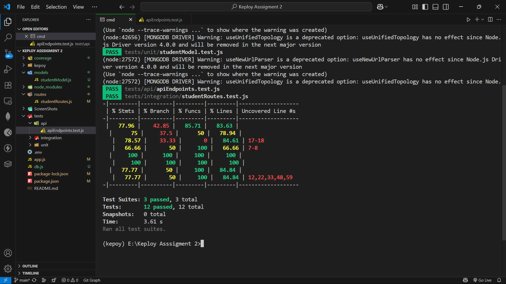
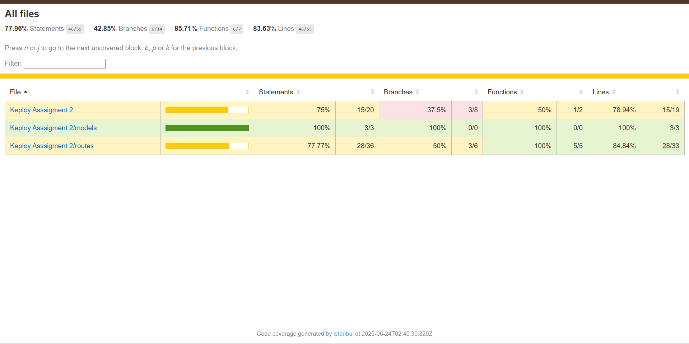
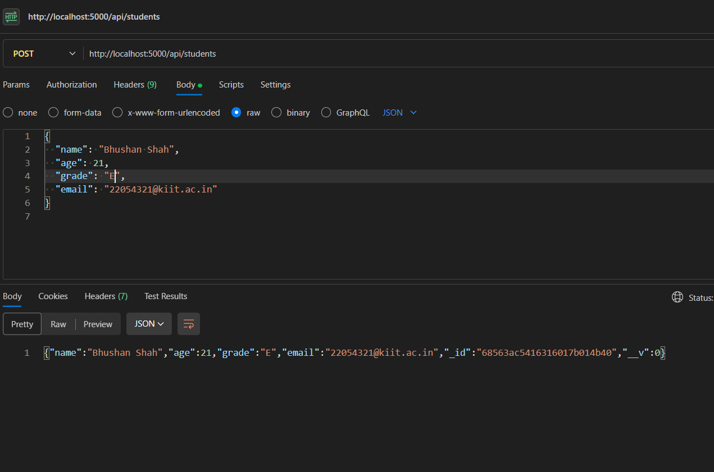
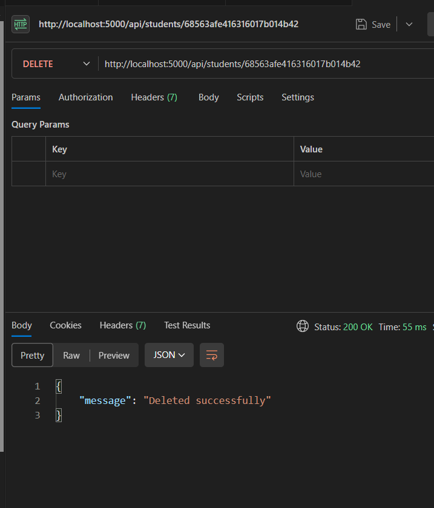
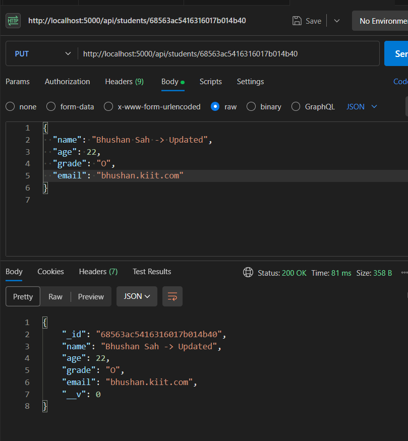
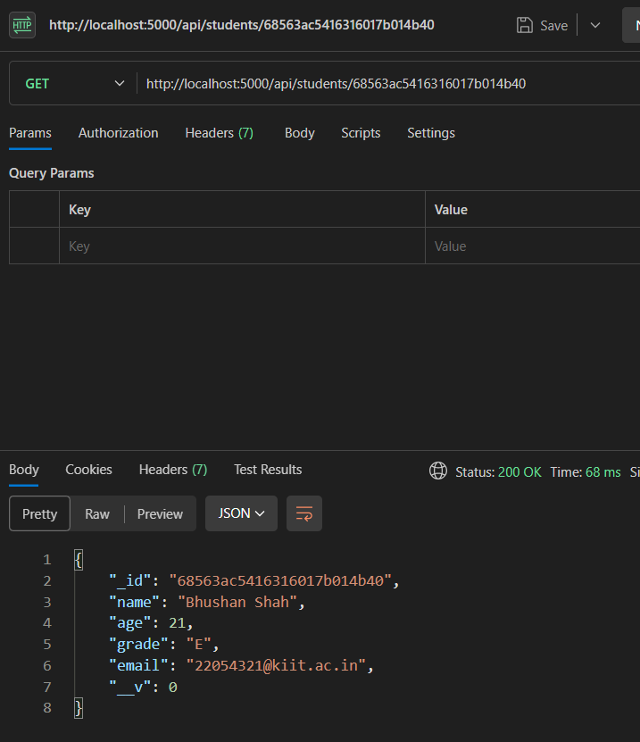

# Student CRUD API


A simple RESTful API for managing student records, built with **Node.js**, **Express.js**, and **MongoDB Atlas**.  
Includes full **CRUD** functionality and comprehensive **unit**, **integration**, and **API** tests using **Jest**, **Supertest**, and **mongodb-memory-server**.

---

## 🔧 Tech Stack

- **Backend:** Node.js, Express.js  
- **Database:** MongoDB Atlas (cloud)  
- **ODM:** Mongoose  
- **Testing:**  
  - Unit & Integration: Jest  
  - API (end-to-end): Supertest + mongodb-memory-server  
- **Env Management:** dotenv  
- **Coverage:** Istanbul (via Jest `--coverage`)  

---

## 📁 Project Structure

```

.
├── models/
│   └── studentModel.js         # Mongoose schema
├── routes/
│   └── studentRoutes.js        # CRUD API endpoints
├── tests/
│   ├── unit/
│   │   └── studentModel.test.js
│   ├── integration/
│   │   └── studentRoutes.test.js
│   └── api/
│       └── apiEndpoints.test.js
├── db.js                        # MongoDB connection logic
├── app.js                       # Express app entrypoint
├── .env                         # Environment variables
├── .gitignore
├── package.json
└── README.md

````

---

## ⚙️ Setup & Run

1. **Clone & install**  
   ```bash
   git clone https://github.com/BhushanSah3/Keploy-Assignment-2
   cd student-crud-api
   npm install


2. **Environment**
   Create a file named `.env` in the project root with:

   ```env
   PORT=5000
   MONGO_URI=mongodb+srv://<username>:<password>@<cluster-url>/keploy?retryWrites=true&w=majority&appName=Keploy
   ```

3. **Run the server**

   ```bash
   npm start
   ```

   Server listens on: `http://localhost:5000`

---

## 🚀 API Endpoints

| Method | Endpoint            | Description            |
| :----: | ------------------- | ---------------------- |
|  POST  | `/api/students`     | Create a new student   |
|   GET  | `/api/students`     | Get all students       |
|   GET  | `/api/students/:id` | Get one student by ID  |
|   PUT  | `/api/students/:id` | Update a student by ID |
| DELETE | `/api/students/:id` | Delete a student by ID |

**Example Request Body** (for POST/PUT):

```json
{
  "name": "John Doe",
  "age": 21,
  "grade": "A",
  "email": "john.doe@example.com"
}
```

---

## 🧪 Testing

All tests (unit, integration, API) use **Jest**. To run:

```bash
# For coverage report:
npm test
```

* **Unit tests**: Model validation & schema logic
* **Integration tests**: Route + DB interaction
* **API tests**: End-to-end CRUD via Supertest + in-memory Mongo

**Coverage report** is generated under `coverage/` and summarized above.

---

## 📸 Screenshots
### Coverage Report





## Screenshots of the Responses of CRUD operations

### Read

### Create

### Delete

### Modify

### Read a student by ID


---

## 📄 License

This project is open-source and free to use.

---

## 🙋 Author

**Bhushan Shah**

