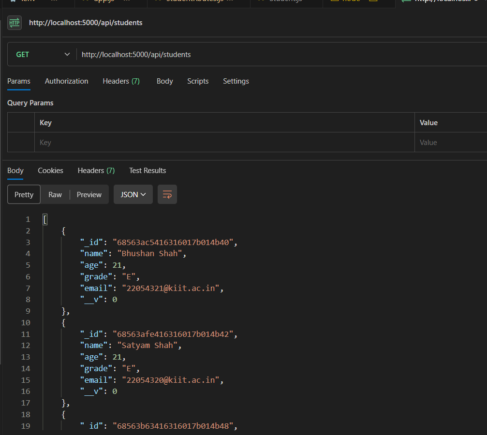

# Student CRUD API

This is a simple RESTful API built with **Node.js**, **Express.js**, and **MongoDB Atlas** for performing **CRUD operations** on student records. It uses **Mongoose** for object data modeling and includes basic API endpoints for creating, reading, updating, and deleting students.

---

## 🔧 Technologies Used

- Node.js
- Express.js
- MongoDB Atlas (Cloud-hosted)
- Mongoose
- dotenv

---

## 📁 Project Structure

```

.
├── models/
│   └── Student.js         # Mongoose schema for student
├── routes/
│   └── studentRoutes.js   # API routes
├── .env                   # Environment variables
├── app.js                 # Main server file
├── package.json

````

---

## ⚙️ Setup Instructions

### 1. Clone the Repository

```bash
git clone https://github.com/your-username/student-crud-api.git
cd student-crud-api
````

### 2. Install Dependencies

```bash
npm install
```

### 3. Configure Environment Variables

Create a `.env` file in the root directory and add the following:

```env
PORT=5000
MONGO_URI=mongodb+srv://<username>:<password>@<cluster-url>/keploy?retryWrites=true&w=majority&appName=Keploy
```

---

## 🚀 Run the Server

```bash
node app.js
```

The server will start at:

```
http://localhost:5000
```

---

## 📌 API Endpoints

### ➕ Create a Student

```http
POST /api/students
```

**Request Body:**

```json
{
  "name": "John Doe",
  "age": 21,
  "grade": "A",
  "email": "johndoe@example.com"
}
```

---

### 📥 Get All Students

```http
GET /api/students
```

---

### 📄 Get a Student by ID

```http
GET /api/students/:id
```

---

### ✏️ Update a Student

```http
PUT /api/students/:id
```

**Request Body:**

```json
{
  "grade": "B"
}
```

---

### ❌ Delete a Student

```http
DELETE /api/students/:id
```

## Screenshots of the Responses of CRUD operations

### Read

### Create

### Delete

### Modify

### Read a student by ID


## 📄 License

This project is open-source and free to use.

---

## 🙋 Author

**Bhushan Shah**
Student Developer @ KIIT
